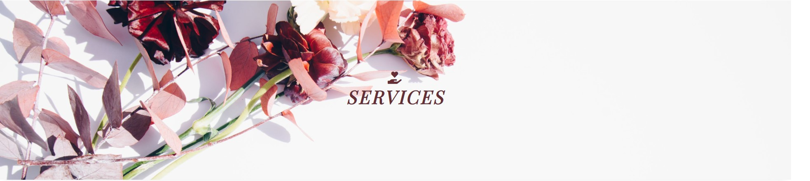
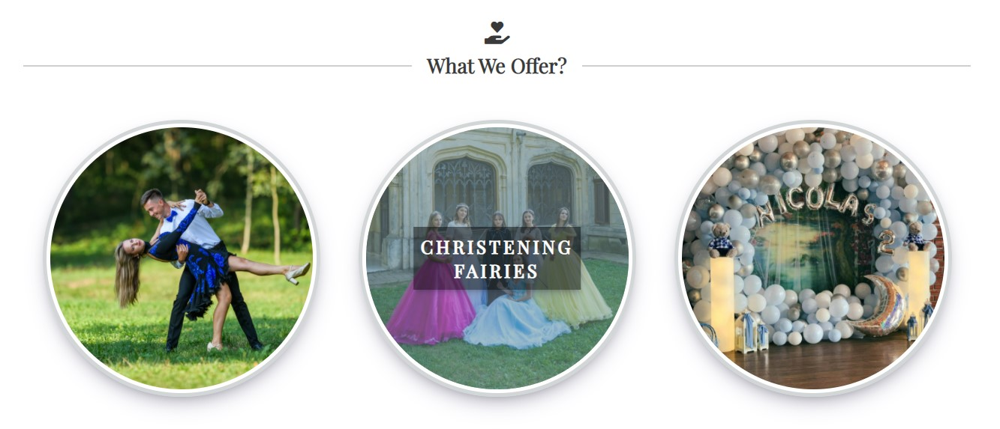
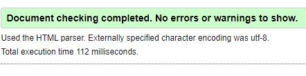
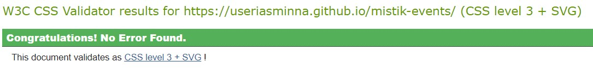
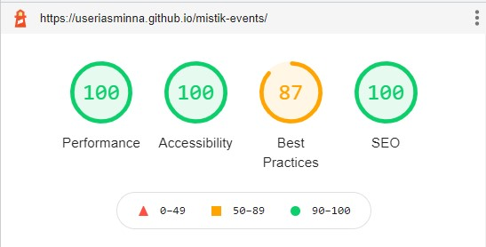
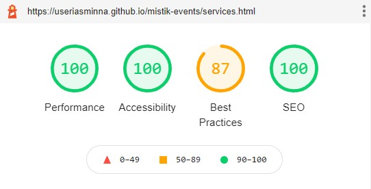
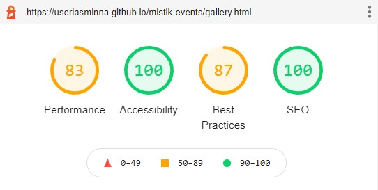
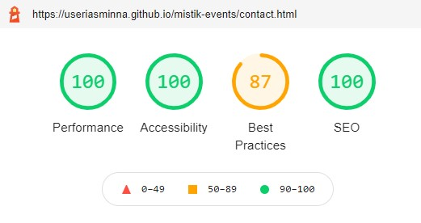
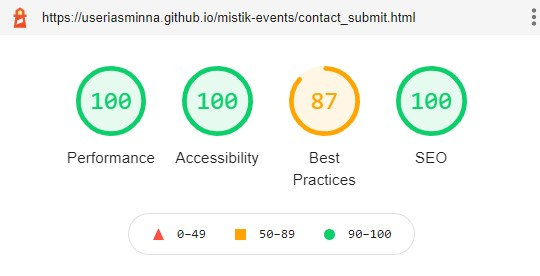

# Mistik Events
## Purpose
Mistik Events is a website created for people who need entertainment services or decorations for special events in their lives. The target audience is made up of people of any age except children because the site specifically targets people who participate in organizing the event and can make the decision of requesting the services offered by Mistik Events. This site will also be useful for people to get the best information about Mistik Events and what it has to offer.  
The website can be viewed [here](https://l.messenger.com/l.php?u=https%3A%2F%2Fuseriasminna.github.io%2Fmistik-events%2F&h=AT0Y6JzKcOEH4dNrnciKCXesI7OiSsk0Od29tNhU35e6qr6a8cO1cVfuUYPkO9hhanDMK2UmB_0KZ-uo8eeV5uoLej3Kiz1HJ2BOjPGWsGw75NWts8LL0dUWxUEWA6VKlUnTA8UF4W9Zir2KiU1oyw)  

## UX/UI
This site was created so that users can easily understand all the content that appears on the site, in order to increase the requests for services and therefore the popularity and profit of the company. That being said, the site must meet a number of requirements:  
-The site should have a simple and intuitive navigation menu 
-The informations that appear on the site must be clear and concise 
-The images should be clear and relevant for the site purpose 
-The site must be accesible for everyone, including people with disabilities  

### User Stories 
* As a user, I want to understand the purpose of the site from the first interaction with it
* As a user, I want to easily navigate through the pages and content of the site
* As a user, I want to see relevant informations about the company and its services
* As a user, I want to see clear and reprezentative images
* As a user, I want to be able to book a service or find contact informations
* As a user, I want to see an attractive website that will make me want to go back to it 

## Wireframes
The wireframes for mobile and desktop can be viewed [here](assets/wireframes/wireframes.pdf) 

## Design
### Color Scheme
* Because this site reflects the theme of night events, the predominant colors used for the font are dark colors. 
* The Home page cover contains color as brown and blue that suggest the ideea of a party and introduces the customer with the company activity. 
* In order to maintain a constant design for the whole website, the footer, the second cover and one of the buttons I created contain the same brown color. 
* For a classic aspect and a good contrast I used a white background with a lighter black color for text. 
* All the buttons and links on the website use the same lighter black color, as well as a lighter gray to make it easier for the user to differentiate between them and their purpose.  

### Images
* I have used 27 images for creating this site, including background images. 
* Most of the images are real images from my own source that are representing the services that Mistik Events has to offer.  
* Except for the slider and the gallery page images I used the other ones as background because I considered them being purely decorative. 
* The images meet the clarity requirements and their dimensions have been adapted for each device so that they never appear distorted. 
* ALl the images have been optimised and compressed with [TinyJPG](https://tinyjpg.com/).
### Fonts
* The fonts I used for this site are Playfair Display and Dancing Script and both were imported from [Google Fonts](https://fonts.google.com/)

## Features
### Existing Features 
The website has four main pages (<b> HOME, SERVICES, GALLERY, CONTACT US</b>) that are accesible to the user anytime through the navigation menu and an additional page that only appears to the user when the contact form is succesfully submitted.

#### Navigation Menu
The Nav Bar is present on all pages so the user cand easily switch between them at anytime. Every item in the nav list have an underline hover effect for inactive pages and also changes to icon when a page is active  

#### Footer
The Footer contains sugestive icons linked to the social media accounts and it can be found at the end of every page.  

#### Cover
There is a main cover for the Home page and a secondary cover for the rest of the pages. Their purpose is to inform the user about the name and slogan of the company, in the case of the first cover, and about the name of the page, in the case of the second cover.  

#### HOME/INDEX PAGE
The Home page is structured in three sections (<b>About Us, Slider, Services</b>) which are intended to familiarize the user with the company's activity. 
* <b>About Us</b> section contain a short description of the company and a button linked to the contact form.  
    
* <b>Slider</b> section gives the user the possibilitty to navigate through seven representative images.  
    
* <b>Services</b> section shows the three services available in the form of circular images linked to the coresponding Services page section. Every circular image has an hover effect visible in the picture bellow. For mobile versions this section also has a button linked to Services page because there are no hover effects and the user may not figure out that the images are clickable.  
    

#### SERVICES PAGE
The Services page contains a picture and a brief description for every service available. The information given for every service is clear and succint for not risking losing the reader's attention. At the end of every description there is a link to the Gallery page.  
    

#### GALLERY PAGE
The Gallery page shows the user a number of twelve pictures representatives for the three services available.  
  

#### CONTACT US PAGE
The Contact page contains a form and a phone number for the user to get in touch whith the company for booking an event.
All the form's input are required.  
  
When the user fill all the spaces in the correct way a Succesfully Submited page appears.  
  

### Features Left To Implement 
* Redirect all the informations submitted in the form to a real database or email for the company to be able to reply to the user
* Create a section where the user can customize with multiple choices the service he wants

## Unfixed Bugs Or Errors
* The <code>nav bar items</code> change their position after clicking on them, which is also caused by changing the text into an icon
* Even if the slider images were resized with the same aspect ratio, when sliding through them there can be noticed that the <code>slider div</code> pushes a little the elements bellow it. I have chosen to resize the images and not to set a specific <code>width</code> and <code>height</code> because I couldn't find the dimensions that will fit well in both extremities of media queries, that meaning that the dimensions would have to be set in too many media queries.
* Set a minim value for the <code>form's date type input </code> that will automatically update everyday with the present day so the user won't be able to chose a date that has passed
* Replace the <code>select</code> from the <code>form</code> with a <code>checkbox group</code> that will require at least one checkbox to be selected so the user can book multiple services at once
* There are 2 commits on GitHub where the message doesn't correspond with the commit and I didn't knew how to delete and recommit them after pushing. One has the message "http.server" and another one was commited with the message "Fix accesibility".

## Testing
I've manually tested every feature of the site so I can make sure they meet all the requirements:  

* As a user, I want to understand the purpose of the site from the first interaction with it 
When the site first loads, it will always appear on the home page, where the cover page shows a suggestive name and slogan for the company. Also, when the user scrolls through the Home Page, they will immediately find a description and some images that will familiarize them with the company's activity.  
* As a user, I want to easily navigate through the pages and content of the site 
The navigation menu is always at the top of the page, and the current page can be distinguished from the others because it turns into an icon. To help the user get to the menu faster, there is a button at the bottom of the page that will bring it to the top of the page.  
I made sure that all the menu items behave accordingly when switching between them and the button links to the menu on every page.  
* As a user, I want to see relevant information about the company and its services 
Every description on the site is short and concise.  
* As a user, I want to see clear and representative images 
We chose real images from events or photo sessions with people participating in Mistik Events activities. 
I made sure all the images are responsive and maintain the clarity on every device.  
* As a user, I want to be able to book a service or find contact information 
On the last page there is a form that can be filled in to book an event. The form will finally be updated when I learn how to use the right technologies for data storage. 
I tested and made sure that the form display the Succesfully submited page when the user fills in the form in the correct way.  
* As a user, I want to see an attractive website that will make me want to go back to it 
We created an easy-to-use design using suggestive cover backgrounds, hover effects on each button and link, colors and fonts that bring the user closer to the idea of ​events and entertainment. 
I tested all the buttons and links to make sure they redirect to the right link, that all the hover effects work on desktop and all the external links open in a new tab.  

## Validator Testing
### HTML
I validated the HTML code with the website URL using [HTML - W3C HTML Validator](https://validator.w3.org/#validate_by_uri+with_options)  

### CSS
I validated the CSS code with the website URL using [CSS - Jigsaw CSS Validator](https://jigsaw.w3.org/css-validator/#validate_by_uri)  

### Lighthouse
I generated a Lighthouse report for every page of the website.
Each raport has a lower score on Best Practices based on <code>third-party cookies</code> Issue and an <code>unload listener</code> error which came from the Font Awesome API.  

#### HOME

#### SERVICES

#### GALLERY
The Performance gets a lower score because the <code> image</code> elements do not have explicit width and height.
I chose to let the images have their unique dimensions so that the user can see them in their entirety.  

#### CONTACT US

#### CONTACT SUBMIT

### Accessibility
I put the website through WAVE - accessibility evaluation tool. 
The Full Report can be found [here](https://wave.webaim.org/report#/https://useriasminna.github.io/mistik-events/).

## Deployment
This site was created using the [Code Institute Full Template](https://github.com/Code-Institute-Org/gitpod-full-template).
The steps were as following:
- Click the <i>Use this template</i> button
- A New Repository page will appear, write a Repository name and a short description and press <i>Create repository from template</i>
- Press the green Gitpod button to create your project workspace and start developing your website </b>
  
After finishing developing the site I deployed it on Githup Pages following the instructions:
- Go to <i>Settings</i>
- Scroll down to <i>Github Pages</i>
- From Source choose <i>main</i> and Save, this is the branch from where your site will be deployed
- A link to your website deployed will be generated

## Credits
### Content 
The content on this side was created using real informations about Mistik Events.
### Code 
- The Title decoration I used on the home page were taken and adapted from [Stack Over Flow](https://stackoverflow.com/questions/15557627/heading-with-horizontal-line-on-either-side)
- The Javascript function for the Slider was taken and adapted from [w3schools](https://www.w3schools.com/howto/tryit.asp?filename=tryhow_js_slideshow)
- I red about and adapted the RegExp pattern I used for the form input from [MDN Web Docs](https://developer.mozilla.org/en-US/docs/Web/HTML/Element/input/tel)
- All the <code>box-shadow</code> properties I used were taken from [CSS Scan](https://getcssscan.com/css-box-shadow-examples)
- The Gallery structure was inspired from the Code Institute - Love Running project
### Media 
- The Cover images were taken from [Pexels](https://www.pexels.com/)
- The other 25 images used as background or for the slider and gallery were real images taken from Mistik Events photoshoot

## Tools
[GitHub](https://github.com/) - used for hosting the source code of the site and the deployed site on GitHub Pages 
[Gitpod Dev Environment](https://gitpod.io/) - used for developing the website 
[HTML - W3C HTML Validator](https://validator.w3.org/#validate_by_uri+with_options) - used for validating the HTML 
[CSS - Jigsaw CSS Validator](https://jigsaw.w3.org/css-validator/#validate_by_uri) - used for validating the CSS 
[WAVE](https://wave.webaim.org/) - used for checking the accessibility of the website 
[Favicon.io](https://favicon.io/) - used for generating the website favicon 
[Tiny.jpg](https://tinyjpg.com/) - used for compressing the images 
[Diffchecker](https://www.diffchecker.com/) - used for comparing the code 
Chrome Lighthouse and Chrome Developer Tools  - used for checking performance of the website 

